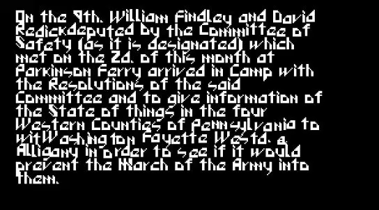

# CoreUI
Simple UI system for Unity

## Preview

  
  
  

Render windows, buttons, slider, progress bars and ... as tiles.

## Text
CoreUIText and CoreUITextMesh(MonoBehaviour) based on custom text rendering.

Text effects:
- Sin effect
- Shake effect

  
  

Text rendering base on the texture of font. Easy font editor included.

  

## Implemented elements
- Window
- Image
- Flexible Image (Progress bar)
- Slider
- Button
- Scroll
- Label
- Toggle

## Development progress
[workflowy](https://workflowy.com/s/HwM7.cApHYq98eb)

[Tileset](http://pixeljoint.com/pixelart/73768.htm)
