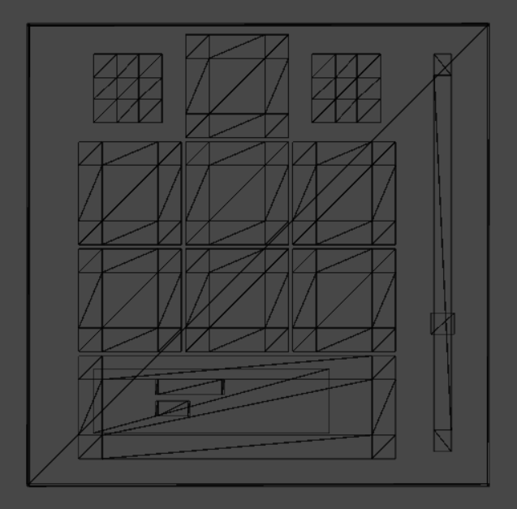
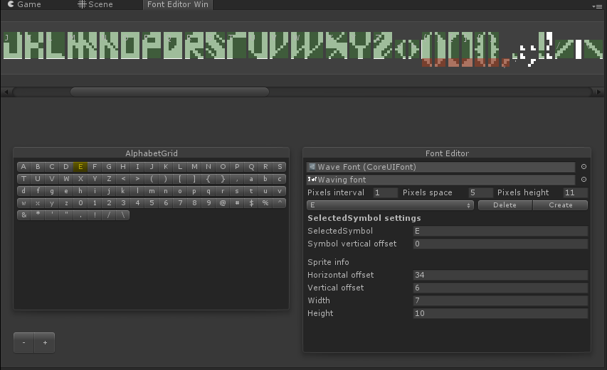

# CoreUI 0.2.0
Simple Pixel Perfect UI system for the Unity. Asset rsender UI elements according to the size of the pixel.

## Preview

   
     
  
  

    
Generated meshes

    
    
  
    

## Implemented UI elements:

  
Window

  

  

  
Image

 

  
Flexible Image (Progress bar)

  

 

  
Slider(Vertical and horizontal)

  

 

  
Button

  

 

  
Scroll

  

 

  
Label

  

 

  
Toggle

  

 

  
Text Field

  

 

## Text
The UI text element and the CoreUITextMesh(MonoBehaviour) are based on custom text rendering. Generation and editing are implemented as a custom editor.

Text effects:
- Sin effect
- Shake effect

  
  
  

## Changelogs

  
0.1.0

  
  - Fix bug when start editor new font
  - Add rect visualisation for all chars in font editor window
  - Add symbols grid for font editor
  - Add main screen points achors to CameraHandler
  - Add Text property to CoreUIText
  - Show some symbols of text
  - CoreUITextMesh memory optimisation
  - Change GenerateMeshData in the TextMesh(text and color; only text)
  - Add updating of color in the presentation element
  - Add checking for duplication when add symbol
  - Exception when create label with empty string
  - Clear mesh in the UpdateMeshInfo
  - Notificate when scene doesn't have any camera with 'MainCamera' tag
  - Setting of execution order
  - Add Id property to button
  - Optimize text (TextMesh:32)
  - Super Space Beaver CoreUIContainer:150
  - Change Button trigger mechanic
  - Add resizing of FlexibleImage
  - Эффекты не работаю в UI, а только в textmesh
  - When change font content doesn't change
  - Autogeneration of font material
  - Connection material to font
  - Fix singleton
  - Problems when switch scene
  - Remove warnings
  - Fix active and enable (CoreUISimplePresentation 68)
  - Add info window of CoreUI(Version)
  - Bug if repository has none style
  - Create coreUI prefab
  - Check multiline text in scroll
  - Add automatic scroll
  - Font editor window exception when font not selected

 

  
0.2.0

  
  - Autoadding styles to repository
  - Styles Repository editor
  - Toggle
  - Update Unity
  - Add a event click releasing when use a click event in a control (prevent a clicking on two buttons on a same position)
  - Textbox
  - Focus
  - Keys navigation
  - Symbol entering
  - Cursor
  - 'Backspace' key
  - 'Delete' key
  - Mouse navigation
  - 'Enter' key
  - Background for touching (the area hides when you delete all symbols) 
  - Set slider start value to start position depends on orientation
  - Bugs
  - Scroll visibility error when in parent scroll

 

## Development progress
[workflowy](https://workflowy.com/s/HwM7.cApHYq98eb)

[Tileset](http://pixeljoint.com/pixelart/73768.htm)
[Tileset](https://www.reddit.com/r/IndieGaming/comments/edxbgy/pixel_art_new_crafting_ui/)
